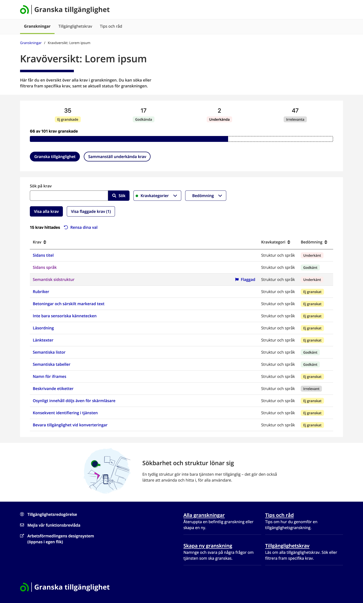

Granska tillgänglighet är ett verktyg från Arbetsförmedlingen för att underlätta granskning av webbtjänsters tillgänglighet och skapa tillgänglighetsredogörelser.

## Om verktyget

Granska tillgänglighet är skapat för att vägleda användare utan expertkunskaper genom processen att granska en webbtjänst mot tillgänglighetskrav och skapa en tillgänglighetsredogörelse. Verktyget baseras på EN 301 549 och WCAG 2.2 nivå AA. Arbetsförmedlingen har gjort en egen bearbetning och sammanställning av dessa krav.

### Funktioner

- **Vägledda granskningar** – Information och vägledning för varje tillgänglighetskrav.
- **Strukturerad dokumentation** – Samla alla granskningsresultat på ett ställe.
- **Tillgänglighetsredogörelser** – Hjälp att formulera tillgänglighetsredogörelser.
- **Exportfunktion** – Skapa buggar i Jira från en exportfil.

<table>
<thead>
<th valign="top" width="25%">Startsida</th><th valign="top" width="25%">Skapa granskning</th><th valign="top" width="25%">Granskningsöversikt</th><th valign="top" width="25%">Granskningsvy</th>
</thead>
<tbody>
<tr>
<td valign="top" width="25%"><ul><li>Visa alla granskningar</li>
<li>Sök efter en granskning</li>
<li>Spara favoritgranskningar i din webbläsare</li>
</ul></td>
<td valign="top" width="25%">Minska mängden krav att granska genom att ange vad din tjänst innehåller.</td>
<td valign="top" width="25%">Sök fram krav och se status för granskningen som helhet.</td>
<td valign="top" width="25%">Få stöd i att bedöma varje krav.</td>
</tr>
<tr>
<td valign="top" width="25%">


</td>
<td valign="top" width="25%"></td>
<td valign="top" width="25%"></td>
<td valign="top" width="25%"></td>
</tr>
</tbody>
</table>

### Användning och flexibilitet

För att använda verktyget behöver du installera det i en driftmiljö och sätta upp en databas. Mer om detta kommer.

Du kan använda verktyget i sin grundversion, eller göra en egen fork och anpassa efter dina egna behov.

Arbetsförmedlingen tillhandahåller kravdata baserat på tillgänglighetslagarna, men du kan också peka på en helt annan datakälla för att skapa ett bedömningsverktyg för valfria andra krav.

## Kom igång

### Snabbstart

```bash
# Kopiera och konfigurera miljövariabler
cp .env.example .env
cp client/.env.example client/.env.local
# Redigera .env och sätt ORACLE_PWD och DB_PASSWORD

# Starta alla tjänster (rekommenderat: väntar tills Database, API och Client är redo)
./scripts/dev-up.sh

# Öppna i webbläsaren
open http://localhost:5173
```

**💻 Windows-användare?** Se [docs/WINDOWS_WSL_SETUP.md](docs/WINDOWS_WSL_SETUP.md) först.

📖 **Fullständig guide:** [QUICKSTART.md](QUICKSTART.md)

## Teknisk stack

- **React Router** – Routing och navigering
- **TypeScript** – Typsäkerhet
- **Vite** – Byggverktyg
- **Arbetsförmedlingens designsystem** - Design och komponenter
- **Tailwind CSS** – Styling
- **i18next** – Internationalisering
- **Oracle Database** – Databas
- **Express.js** – REST API backend
- **Docker** – Containerisering

## Licens

Detta projekt är licensierat under Apache License 2.0 - se [LICENSE](LICENSE) för detaljer.

## Kontakt

Arbetsförmedlingen - [designsystem@arbetsformedlingen.se](mailto:designsystem@arbetsformedlingen.se)
